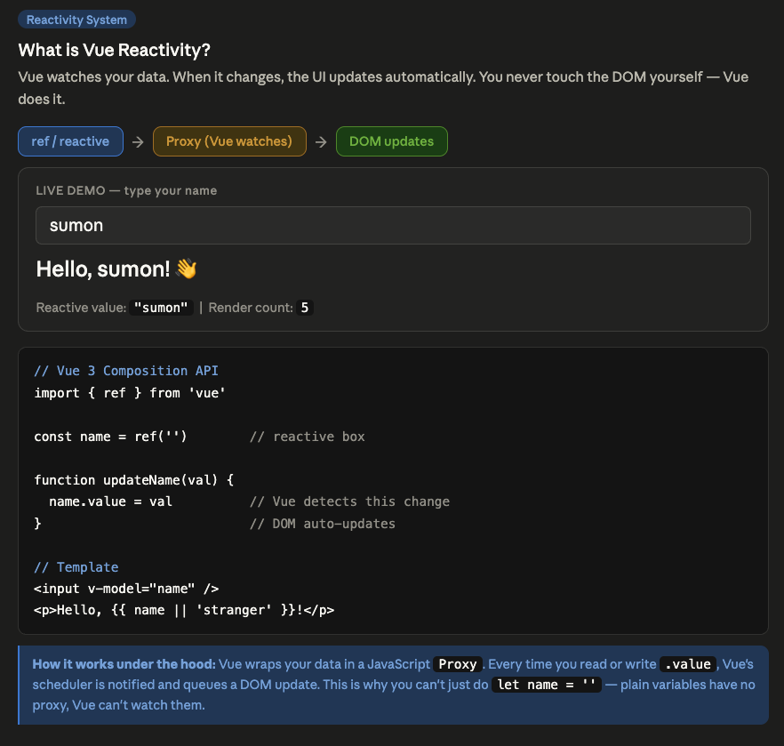

# I Didn't Know This Vue Best Practice...

<details>

<summary>What is Vue Reactivity?</summary>

<figure><figcaption></figcaption></figure>


</details>

<details>

<summary>What is Vue <code>computed</code>?</summary>

<figure><figcaption></figcaption></figure>


</details>

<details>

<summary><code>watch</code> vs <code>computed</code> in Vue ? When to use which?</summary>

* computed — derives/transforms data, cached, returns value, sync
* watch — runs side effects when data changes, can be async, no return value

> Rule of thumb: If you need a value → computed. If a change should do something (fetch, log, save) → watch.

<table><thead><tr><th width="226.483642578125">Topic</th><th>Computed</th><th>Watch</th></tr></thead><tbody><tr><td>Return Value</td><td>YES</td><td>NO</td></tr><tr><td>Cached</td><td>YES</td><td>NO</td></tr><tr><td>Async Support</td><td>NO</td><td>YES</td></tr><tr><td>old/new Value Read</td><td>NO</td><td>YES</td></tr><tr><td>immediate Option</td><td>NO</td><td>YES</td></tr><tr><td>deep Option</td><td>NO</td><td>YES</td></tr><tr><td>Side Effects</td><td>NO</td><td>YES</td></tr></tbody></table>


```vue
<template>
  <div class="p-8 max-w-2xl mx-auto space-y-8">
    <h1 class="text-2xl font-bold">watch vs computed</h1>

    <!-- COMPUTED: derives value from state -->
    <section class="border p-4 rounded">
      <h2 class="text-lg font-semibold mb-2">computed — derive value</h2>
      <p class="text-sm text-gray-500 mb-3">
        Use computed when you need a <strong>value</strong> derived from other state.
        Result is cached — only recalculates when dependency changes.
      </p>
      <input v-model="firstName" placeholder="First name" class="border p-1 mr-2 rounded" />
      <input v-model="lastName" placeholder="Last name" class="border p-1 rounded" />
      <p class="mt-2">Full name: <strong>{{ fullName }}</strong></p>
      <p class="text-xs text-gray-400 mt-1">
        fullName is cached. Accessing it 100x = computed once.
      </p>
    </section>

    <!-- WATCH: side effects when state changes -->
    <section class="border p-4 rounded">
      <h2 class="text-lg font-semibold mb-2">watch — react to change (side effect)</h2>
      <p class="text-sm text-gray-500 mb-3">
        Use watch when a change should trigger a <strong>side effect</strong>:
        API call, logging, writing to localStorage, etc.
      </p>
      <input v-model="searchQuery" placeholder="Type to search..." class="border p-1 rounded w-full" />
      <p class="mt-2 text-sm">
        API calls made: <strong>{{ apiCallCount }}</strong>
      </p>
      <p class="text-xs text-gray-400">
        watch fires on every change — triggers async fetch simulation.
      </p>
      <ul v-if="results.length" class="mt-2 list-disc list-inside text-sm">
        <li v-for="r in results" :key="r">{{ r }}</li>
      </ul>
    </section>

    <!-- WATCH: old vs new value + immediate + deep -->
    <section class="border p-4 rounded">
      <h2 class="text-lg font-semibold mb-2">watch options: immediate + deep</h2>
      <p class="text-sm text-gray-500 mb-3">
        <code>immediate: true</code> runs on mount. <code>deep: true</code> watches nested objects.
        computed cannot do either.
      </p>
      <button @click="user.age++" class="border px-3 py-1 rounded mr-2">Age +1</button>
      <button @click="user.name = 'Alice'" class="border px-3 py-1 rounded">Set name Alice</button>
      <p class="mt-2 text-sm">User: {{ user.name }}, {{ user.age }}</p>
      <div class="mt-2 text-xs text-gray-500 space-y-1">
        <p v-for="(log, i) in watchLog" :key="i">{{ log }}</p>
      </div>
    </section>

    <!-- SIDE BY SIDE COMPARISON -->
    <section class="border p-4 rounded bg-gray-50">
      <h2 class="text-lg font-semibold mb-3">Summary</h2>
      <table class="text-sm w-full">
        <thead>
          <tr class="text-left border-b">
            <th class="pb-2">Feature</th>
            <th class="pb-2">computed</th>
            <th class="pb-2">watch</th>
          </tr>
        </thead>
        <tbody class="space-y-1">
          <tr><td>Returns value</td><td>✅</td><td>❌</td></tr>
          <tr><td>Cached</td><td>✅</td><td>❌</td></tr>
          <tr><td>Async support</td><td>❌</td><td>✅</td></tr>
          <tr><td>Old/new value</td><td>❌</td><td>✅</td></tr>
          <tr><td>immediate option</td><td>❌</td><td>✅</td></tr>
          <tr><td>deep option</td><td>❌</td><td>✅</td></tr>
          <tr><td>Side effects</td><td>❌ (anti-pattern)</td><td>✅</td></tr>
        </tbody>
      </table>
    </section>
  </div>
</template>

<script setup lang="ts">
// Nuxt auto-imports: ref, reactive, computed, watch — no explicit import needed

// ─── COMPUTED example ───────────────────────────────────────────────
const firstName = ref('John')
const lastName = ref('Doe')

// computed: derive a value — cached until firstName or lastName changes
const fullName = computed(() => `${firstName.value} ${lastName.value}`)

// ─── WATCH example: async side effect ───────────────────────────────
const searchQuery = ref('')
const apiCallCount = ref(0)
const results = ref<string[]>([])

// watch: run side effect when searchQuery changes
// can be async — computed cannot
watch(searchQuery, async (newVal: string) => {
  if (!newVal.trim()) {
    results.value = []
    return
  }

  apiCallCount.value++

  // simulate async API fetch
  await new Promise(resolve => setTimeout(resolve, 300))
  results.value = [`Result for "${newVal}" #1`, `Result for "${newVal}" #2`]
})

// ─── WATCH: deep + immediate ─────────────────────────────────────────
const user = reactive({ name: 'Bob', age: 25 })
const watchLog = ref<string[]>([])

// immediate: fires on mount, not just on change
// deep: detects nested property mutations in objects/arrays
watch(
  user,
  (newVal: typeof user) => {
    watchLog.value.unshift(`[${new Date().toLocaleTimeString()}] name=${newVal.name}, age=${newVal.age}`)
    if (watchLog.value.length > 5) watchLog.value.pop()
  },
  { immediate: true, deep: true }
)
</script>

```



</details>

<details>

<summary>What inside <code>immediate</code> and <code>deep</code>  use case in Vue <code>watch</code>?</summary>

<figure><figcaption></figcaption></figure>

***

<figure><figcaption></figcaption></figure>

***

<figure><figcaption></figcaption></figure>

***

<figure><figcaption></figcaption></figure>

***

<figure><figcaption></figcaption></figure>

<figure><figcaption></figcaption></figure>


</details>

<details>

<summary>Avoid <code>watchEffect</code> : Use <code>watch</code></summary>

Implicit dependencies are silent bugs waiting to happen.

**❌ Before (What you might write)**

JavaScript

```
watchEffect(() => {
  // Which reactive values does this track?
  // You have no idea until runtime.
  if (user.value.isAdmin) {
    fetchPermissions(user.value.id)
  }
})
```

> Why this can hurt you: > `watchEffect` silently tracks every reactive value it touches during execution. Add one new `ref` inside and you've accidentally added a new trigger — no warning, no error. It also runs immediately, so you can't easily control when it fires.

**✅ After (What to do instead)**

JavaScript

```
watch(
  () => user.value.id,
  (newId) => {
    fetchPermissions(newId)
  },
  { immediate: true }
)
```

> Why this is safer: > `watch` is explicit about its source. You decide exactly what triggers it, when it runs first (`immediate`), and what the old vs. new values are. Zero surprise reactivity.

</details>

<details>

<summary>Vue's Component Lifecycle Order: <strong>Parent → Child</strong> relationship</summary>

When you have **Parent → Child** relationship, Vue mounts them in this order:

```
Parent beforeCreate
Parent created
Parent beforeMount
  ↓
  Child beforeCreate
  Child created
  Child beforeMount
  Child mounted        ← child finishes FIRST
  ↓
Parent mounted         ← parent finishes LAST
```

**Destruction/Unmount is the OPPOSITE:**

```
Parent beforeUnmount
  ↓
  Child beforeUnmount
  Child unmounted      ← child dies FIRST
  ↓
Parent unmounted       ← parent dies LAST
```

***

#### Now, The Real Problem Your Senior Described

The issue is specifically about **"keep-alive" + async data + lifecycle mismatch.**

Here's the search page scenario:

```
1. You visit Search Page
   → Parent mounts → Child mounts → API call fires → data loads ✅

2. You navigate to Article Page
   → Search page gets DESTROYED (or deactivated if keep-alive)

3. You come BACK to Search Page
   → This is where it breaks
```

**Why does it get stuck in loading?**

There are **two common culprits:**

**Culprit 1: `onMounted` doesn't re-fire on keep-alive**

```vue
<!-- SearchPage (Parent) -->
<script setup>
onMounted(() => {
  fetchResults() // ✅ fires on first visit
                 // ❌ does NOT fire when coming back with keep-alive
})
</script>
```

With `<keep-alive>`, Vue **caches** the component instead of destroying it. So `onMounted` never runs again. You need `onActivated` instead:

```vue
<script setup>
import { onMounted, onActivated } from 'vue'

onMounted(() => {
  fetchResults() // first visit
})

onActivated(() => {
  fetchResults() // every time you come BACK
})
</script>
```

***

**Culprit 2: Parent depends on Child's data, but Child isn't ready yet**

```vue
<!-- Parent -->
<template>
  <SearchFilters @ready="onFilterReady" />  <!-- child -->
</template>

<script setup>
const onFilterReady = () => {
  fetchResults() // parent waits for child signal
}
</script>
```

When you **come back**, the parent assumes the child will emit `ready` again — but if the child is cached (keep-alive), it **won't re-emit**. Parent is stuck waiting for a signal that never comes.

***

**Culprit 3: Reactive state stuck in "loading" state**

```vue
<script setup>
const isLoading = ref(true) // starts as true

onMounted(async () => {
  await fetchResults()
  isLoading.value = false // ✅ works on first visit
})
</script>
```

If the component is **kept alive** and `onMounted` doesn't re-run, `isLoading` stays at whatever value it was. If something reset it to `true` before unmount, you're stuck.

***

#### The Full Mental Model

```
FIRST VISIT:
Parent mounts → Child mounts → Child emits/ready → Parent fetches → ✅

WITH KEEP-ALIVE, COMING BACK:
Parent activated (not mounted) 
Child activated (not mounted) 
→ No re-emit from child
→ Parent waiting... forever 💀
```

***

#### The Fix Pattern (Clean Way)

```vue
<!-- In your Search Page Parent -->
<script setup>
import { ref, onMounted, onActivated } from 'vue'

const isLoading = ref(false)
const results = ref([])

async function fetchResults() {
  isLoading.value = true
  try {
    results.value = await api.search()
  } finally {
    isLoading.value = false  // always reset, even on error
  }
}

onMounted(fetchResults)     // first visit
onActivated(fetchResults)   // coming back via keep-alive
</script>
```

***

#### Quick Summary Table

| Situation                  | Hook to use     |
| -------------------------- | --------------- |
| First time component loads | `onMounted`     |
| Coming back (keep-alive)   | `onActivated`   |
| Leaving (keep-alive)       | `onDeactivated` |
| Component truly destroyed  | `onUnmounted`   |

***

The key insight your senior was pointing at: **Vue's lifecycle order means the child is always "done" before the parent knows about it** — and when keep-alive is involved, that handshake between child and parent can silently break on return visits.

</details>

<details>

<summary>Sending Events from <strong>Client  →  Parent</strong>?</summary>

<figure><figcaption></figcaption></figure>


</details>

<details>

<summary>What is  <code>&#x3C;keep-alive></code> in Vue?</summary>

#### `<keep-alive>` is NOT default behavior

By default, when you navigate away from a component, Vue **destroys it completely**. Every state, every API call — gone. When you come back, it starts fresh from zero.

`<keep-alive>` is something you **explicitly wrap** around components to cache them.

***

#### Where is it saved?

It's saved in **memory (RAM)** — specifically in the browser's JavaScript heap. Not localStorage, not sessionStorage, not any disk. Just the browser's current memory for that tab.

```
Browser Memory (JS Heap)
├── Vue App Instance
│   ├── Active Component (what you see)
│   └── keep-alive cache
│       ├── SearchPage (cached, hidden)
│       ├── ProfilePage (cached, hidden)
│       └── ...
```

So if you **refresh the page or close the tab** — cache is gone. It's session-level, in-memory only.

***

#### How is it controlled?

**Basic Usage — you wrap it manually**

```vue
<template>
  <keep-alive>
    <SearchPage />
  </keep-alive>
</template>
```

***

**In Vue Router (most common real-world usage)**

```vue
<!-- App.vue or your layout -->
<template>
  <router-view v-slot="{ Component }">
    <keep-alive>
      <component :is="Component" />
    </keep-alive>
  </router-view>
</template>
```

This caches **every** page you visit. That's usually too aggressive.

***

**Selective Caching — `include` and `exclude`**

```vue
<!-- Only cache these specific components -->
<keep-alive include="SearchPage,ProfilePage">
  <component :is="Component" />
</keep-alive>

<!-- Cache everything EXCEPT these -->
<keep-alive exclude="CheckoutPage,LoginPage">
  <component :is="Component" />
</keep-alive>
```

The name it matches against is your component's `name` option:

```vue
<!-- SearchPage.vue -->
<script>
export default {
  name: 'SearchPage'  // ← this is what keep-alive matches
}
</script>

<!-- OR in script setup (Nuxt/Vue 3 way) -->
<script setup>
defineOptions({
  name: 'SearchPage'
})
</script>
```

***

**Max cache limit — `max`**

```vue
<!-- Only keep the last 5 visited pages in cache -->
<keep-alive :max="5">
  <component :is="Component" />
</keep-alive>
```

When the 6th page is visited, the **oldest cached one gets destroyed** (LRU — Least Recently Used).

***

**In Nuxt specifically**

Nuxt doesn't enable keep-alive by default either. You control it in the router or layout:

```vue
<!-- layouts/default.vue -->
<template>
  <NuxtPage keepalive />  <!-- enables keep-alive for all pages -->
</template>
```

Or selectively per page using `definePageMeta`:

```vue
<!-- pages/search.vue -->
<script setup>
definePageMeta({
  keepalive: true  // only this page gets cached
})
</script>
```

***

#### Full Lifecycle with vs without keep-alive

```
WITHOUT keep-alive (default):
Visit Search → mounted → leave → UNMOUNTED (destroyed)
Come back   → mounted again (fresh start)

WITH keep-alive:
Visit Search → mounted → leave → deactivated (cached in memory)
Come back   → activated (restored from cache, mounted NOT called again)
```

***

#### Quick Decision Guide

```
Do you need scroll position preserved?     → use keep-alive
Do you need filters/search state saved?    → use keep-alive
Is it a form or checkout page?             → DON'T use keep-alive
Does the page need fresh data every visit? → DON'T use keep-alive
                                             (or use onActivated to re-fetch)
```

***

So to directly answer you — **it's not default, it's opt-in, and it lives in browser memory only for that tab session.** Your senior's bug almost certainly came from someone adding `keep-alive` to the router layout without realizing the lifecycle hooks change completely when you do that.

</details>

<details>

<summary>How to validate props in Vue Components with Default Value?</summary>

```vue
<script setup lang="ts">
defineProps({
  type: {
    type: String,
    default: 'default',
    validator: (value: string) =>
      ['primary', 'ghost', 'dashed', 'link', 'text', 'default'].includes(value),
  },
})
</script>

<template>
  <button>Button</button>
</template>

```

</details>


